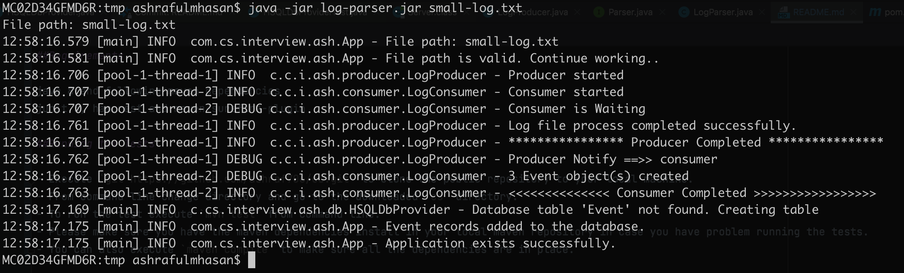

## Running the Tests

- Execute `git clone https://github.com/ashraf706/cs.git` to clone the public repository to your local machine.
- From command line change directory and go to the downloaded `cs` folder.
- To run the test execute `mvn test` from the command line. 

## Running the Application
- Executing `mvn install` should create  **log-parser.jar** with dependencies in the `target` folder.
- Run `java -jar log-parser.jar LOG_FILE_PATH`. Replace the `LOG_FILE_PATH` with a valid file path.
- For an example `java -jar log-parser.jar small-log.txt` produces the following output
  

## Improvement I could make

- Assumed the log file has no issue and didn't consider any bug, blank line etc. 
- State should be **enumeration** rather than string the Log class.
- Provider could be implemented as a consumer as well.
- Log should be appended to a file.
- Didn't handle exception cleanly.
- In one of test added thread sleep for a quick fix.